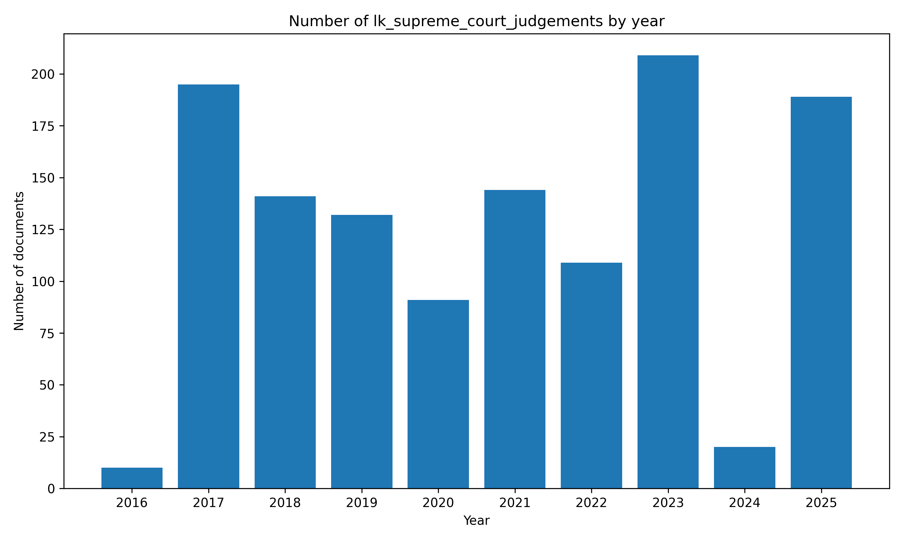

# 📜 🇱🇰 #SriLanka Supreme Court Judgements

 🔗 Data Source: supremecourt.lk

 🔗 All Raw Data: [https://github.com/nuuuwan/lk_supreme_court_judgements/tree/data](https://github.com/nuuuwan/lk_supreme_court_judgements/tree/data)

 📅 Date Range: 2016-07-22 to 2025-09-16

 📑 Number of Docs: 1,229

 📎 Number of Docs with PDFs: 697

 💾 Dataset Size: 0.6GB

🆓 Public data, fully open-source – fork freely!

🔍 Useful for Journalists, Researchers, Lawyers & law students, Policy watchers & Citizens who want to stay informed

🐞 #WorkInProgress - Suggestions, Questions, Ideas, [Bug Reports](https://github.com/nuuuwan/lk_supreme_court_judgements/issues) are welcome!

#SriLanka #OpenData #GovTech
## 📝 Example Metadata

```json
{
    "num": "SC/FR/3/2009",
    "date_str": "2025-09-16",
    "description": "",
    "url_pdf": "https://supremecourt.lk/wp-content/uploads/judgements/sc_fr_3_2009.pdf",
    "url_metadata": "https://supremecourt.lk/judgements/",
    "parties": "1. Sumith Aluthkorala. 42/C, Western Malamulla, Panadura. PETITIONER Vs. 1. Western Province Provincial Road Development Authority, No. 50, Kithulwala Road, Colombo 08. And presently No. 59, Sebastian Hill, Colombo 12. 2. W. Jayasekara Former Chairman, Western Province Provincial Road Development Authority, Kithulwatta Road, Colombo 08. 2a. Rohan Kulasiri, Former Chairman, Western Province Provincial Road Development Authority, No. 50, Kithulwatta Road, Colombo 08. 2b. Upali Kodikara Chairman, No. 59, Sebastian Hill, Colombo 12 Kithulwatta Road, Colombo 08. 3. I.A.M. Jousie, Former Director, 3a. N. Bandula Prama Kumara, Director, 4. Lakshman Hettiarachchi Former Director, 4a. P.K.D. Thisera, Director, 5. Sepala Ruparatne, Former Director, 5a. J.E.L.T. Rathnayake, Former Director, 5b. T.M.W. Mudali, Director, 6. Silva Priyaratne, Former Director, 6a. I.J. Mirando Former Director, 6b. N.I. Senaratne, Director, 7. P. Sivapada Sundaram, Former Director, 7a. U.O. Janmuthupura, Former Director, 7b. T.G.W. Rajapaksha, Director, All of the Western Province Provincial Road Development Authority, No. 50, Kithulwatta Road, Colombo 08. 8. R.M.S. Bandaranayake, General Manager, Western Province Provincial Road Development Authority, No. 50, Kithulwatta Road, Colombo 08. 9. A. Ramanayake, Former Secretary, Provincial Ministry of Roadways and Co-operatives, Denzil Kobbekaduwa Mawatha, Battaramulla. 9a. Sunil Abayawardena, Former Secretary, Provincial Ministry of Roadways and Co-operatives, Denzil Kobbekaduwa Mawatha, Battaramulla. 9b. Champa N. Perera, Secretary, Provincial Ministry of Roadways and Co-operatives, Denzil Kobbekaduwa Mawatha, Battaramulla. 10. Lalith Wanigaratne Former Provincial Ministry of Roadways and Co-operatives, Denzil Kobbekaduwa Mawatha, Battaramulla. 10a. W.A. Nimal Lansa, Former Provincial Ministry of Road Development Housing and Constructions, Live Stock Development, Fisheries and Tourism, Denzil Kobbekaduwa Mawatha, Battaramulla. 11. Attorney General, Attorney General\u2019s Department, Colombo 12. RESPONDENTS\n\nView More",
    "judgement_by": "Hon. Janak De Silva J"
}
```

[source data](https://github.com/nuuuwan/lk_supreme_court_judgements/tree/data/data/lk_supreme_court_judgements/2020s/2025/2025-09-16-SC-FR-3-2009)

## Documents By Year



## 🤗 Hugging Face Datasets

- 📄 [nuuuwan/lk-supreme-court-judgements-docs](https://huggingface.co/datasets/nuuuwan/lk-supreme-court-judgements-docs)
- 📦 [nuuuwan/lk-supreme-court-judgements-chunks](https://huggingface.co/datasets/nuuuwan/lk-supreme-court-judgements-chunks)

## 20 Latest documents

- 2025-09-16 | `SC/FR/3/2009` | 1. Sumith Aluthkorala. 42/C, ... | Hon. Janak De Silva J | [data](https://github.com/nuuuwan/lk_supreme_court_judgements/tree/data/data/lk_supreme_court_judgements/2020s/2025/2025-09-16-SC-FR-3-2009)
- 2025-09-12 | `SC/APPEAL/59/2024` | China Great Wall Hospital Pri... | Hon. Achala Wengappuli J | [data](https://github.com/nuuuwan/lk_supreme_court_judgements/tree/data/data/lk_supreme_court_judgements/2020s/2025/2025-09-12-SC-APPEAL-59-2024)
- 2025-09-12 | `SC/APPEAL/40/2015` | Ihala Hewage Don Bonny Jayara... | Hon. Janak De Silva J | [data](https://github.com/nuuuwan/lk_supreme_court_judgements/tree/data/data/lk_supreme_court_judgements/2020s/2025/2025-09-12-SC-APPEAL-40-2015)
- 2025-09-11 | `SC/FR/403/2015 AND SC/FR/404/2015` | I.P.D.P. Kulasuriya, No. 53/2... | Hon. A.L. Shiran Gooneratne J | [data](https://github.com/nuuuwan/lk_supreme_court_judgements/tree/data/data/lk_supreme_court_judgements/2020s/2025/2025-09-11-SC-FR-403-2015-AND-SC-F-6d6cc413)
- 2025-09-11 | `SC/FR/402/2019 AND SC/FR/429/2015` | 1. N. Jayasena, No. 290/4, Ni... | Hon. Sampath B. Abayakoon J | [data](https://github.com/nuuuwan/lk_supreme_court_judgements/tree/data/data/lk_supreme_court_judgements/2020s/2025/2025-09-11-SC-FR-402-2019-AND-SC-F-0b1269f2)
- 2025-09-11 | `SC/APPEAL/86/2009` | Dilani Nima Nanayakkara, 150,... | Hon. A. L. Shiran Gooneratne J | [data](https://github.com/nuuuwan/lk_supreme_court_judgements/tree/data/data/lk_supreme_court_judgements/2020s/2025/2025-09-11-SC-APPEAL-86-2009)
- 2025-09-11 | `SC/APPEAL/34/2021` | Karunasundera Devayalage Upul... | Hon. Menaka Wijesundera J | [data](https://github.com/nuuuwan/lk_supreme_court_judgements/tree/data/data/lk_supreme_court_judgements/2020s/2025/2025-09-11-SC-APPEAL-34-2021)
- 2025-09-11 | `SC/APPEAL/28/2023` | 1. Dr. Asela Gunawardena, Dir... | Hon. Janak De Silva J | [data](https://github.com/nuuuwan/lk_supreme_court_judgements/tree/data/data/lk_supreme_court_judgements/2020s/2025/2025-09-11-SC-APPEAL-28-2023)
- 2025-09-11 | `SC/APPEAL/153/2018` | Pathirana Arachchige Vipulasi... | Hon. A.L. Shiran Gooneratne J | [data](https://github.com/nuuuwan/lk_supreme_court_judgements/tree/data/data/lk_supreme_court_judgements/2020s/2025/2025-09-11-SC-APPEAL-153-2018)
- 2025-09-10 | `SC/FR/282/2015` | 1. K. D. Chandrasekara, 2. K.... | Hon. S. Thurairaja PC J | [data](https://github.com/nuuuwan/lk_supreme_court_judgements/tree/data/data/lk_supreme_court_judgements/2020s/2025/2025-09-10-SC-FR-282-2015)
- 2025-09-09 | `SC/FR/371/2015` | 1. Pitawasala Koralage Handun... | Hon. Sampath B. Abayakoon J | [data](https://github.com/nuuuwan/lk_supreme_court_judgements/tree/data/data/lk_supreme_court_judgements/2020s/2025/2025-09-09-SC-FR-371-2015)
- 2025-09-08 | `SC/APPEAL/162/2013` | 1. W.H.M. Gunaratne, 251/1, D... | Hon. Sampath B. Abayakoon J | [data](https://github.com/nuuuwan/lk_supreme_court_judgements/tree/data/data/lk_supreme_court_judgements/2020s/2025/2025-09-08-SC-APPEAL-162-2013)
- 2025-09-08 | `SC/APPEAL/115/2013` | 1B,16A. Edirisingha Mudiyanse... | Hon. Janak De Silva J | [data](https://github.com/nuuuwan/lk_supreme_court_judgements/tree/data/data/lk_supreme_court_judgements/2020s/2025/2025-09-08-SC-APPEAL-115-2013)
- 2025-09-04 | `SC/FR/276/2018` | Lokugamhewage Deepika Damayan... | Hon. Menaka Wijesundera J | [data](https://github.com/nuuuwan/lk_supreme_court_judgements/tree/data/data/lk_supreme_court_judgements/2020s/2025/2025-09-04-SC-FR-276-2018)
- 2025-09-04 | `SC/CHC APPEAL/52/2019` | Lanka Orix Leasing Company PL... | Hon. Menaka Wijesundera J | [data](https://github.com/nuuuwan/lk_supreme_court_judgements/tree/data/data/lk_supreme_court_judgements/2020s/2025/2025-09-04-SC-CHC-APPEAL-52-2019)
- 2025-09-04 | `SC/APPEAL/98/2014` | 1. Jayasuriya Arachchige Leel... | Hon. Janak De Silva J | [data](https://github.com/nuuuwan/lk_supreme_court_judgements/tree/data/data/lk_supreme_court_judgements/2020s/2025/2025-09-04-SC-APPEAL-98-2014)
- 2025-09-04 | `SC/APPEAL/85/2023` | Mallawa Waduge Jayaratne No. ... | Hon. M. Sampath K. B. Wijeratne J | [data](https://github.com/nuuuwan/lk_supreme_court_judgements/tree/data/data/lk_supreme_court_judgements/2020s/2025/2025-09-04-SC-APPEAL-85-2023)
- 2025-09-04 | `SC/APPEAL/67/2025` | Lillie Rupasinghe No. 25, Hil... | Hon. Sobhitha Rajakaruna J | [data](https://github.com/nuuuwan/lk_supreme_court_judgements/tree/data/data/lk_supreme_court_judgements/2020s/2025/2025-09-04-SC-APPEAL-67-2025)
- 2025-09-04 | `SC/APPEAL/54/2022` | Ignatius Brito Kaithan Pulle ... | Hon. M. Sampath K. B. Wijeratne J | [data](https://github.com/nuuuwan/lk_supreme_court_judgements/tree/data/data/lk_supreme_court_judgements/2020s/2025/2025-09-04-SC-APPEAL-54-2022)
- 2025-09-04 | `SC/APPEAL/38/2022` | 1. International Center for E... | Hon. Sobhitha Rajakaruna J | [data](https://github.com/nuuuwan/lk_supreme_court_judgements/tree/data/data/lk_supreme_court_judgements/2020s/2025/2025-09-04-SC-APPEAL-38-2022)
