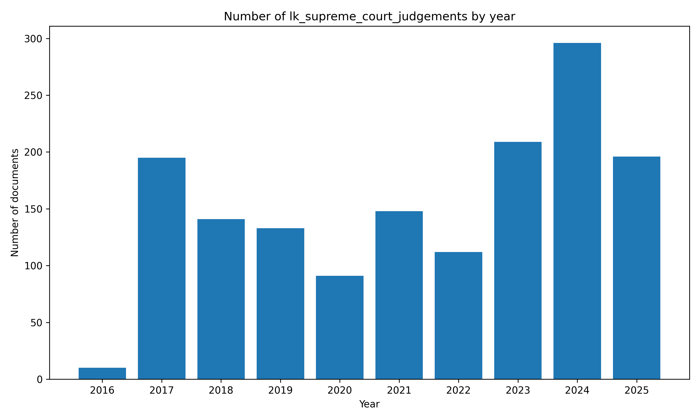

# 🇱🇰 #SriLanka Supreme Court Judgements `Dataset`


[https://github.com/nuuuwan/lk_supreme_court_judgements](https://github.com/nuuuwan/lk_supreme_court_judgements)

📜 [**1,240** documents](https://github.com/nuuuwan/lk_supreme_court_judgements/tree/data) (**0.1 GB**), from **2016-07-22** to **2025-09-17**, scraped from **[https://supremecourt.lk/judgements/](https://supremecourt.lk/judgements/)**

📑 In JSON, PDF, TXT and 🤗 Hugging Face Formats

⏰ Updated **at least Daily**

🆓 Public data & fully open-source

#OpenData #DataScience #DataForGood #ResearchData #NLP

...

*📒 PDFs have been downloaded for **253** (**20%**) documents*

🪲 #WorkInProgress - Suggestions, Questions, Ideas, & [Bug Reports](https://github.com/nuuuwan/lk_supreme_court_judgements/issues) are welcome!

## 📝 Example Metadata

```json
{
    "doc_type": "lk_supreme_court_judgements",
    "doc_id": "2025-09-17-SC-FR-77-2018",
    "num": "SC/FR/77/2018",
    "date_str": "2025-09-17",
    "description": "",
    "url_metadata": "https://supremecourt.lk/judgements/",
    "lang": "en",
    "url_pdf": "https://supremecourt.lk/wp-content/uploads/judgements/sc_fr_77_2018.pdf",
    "parties": "1. Atham Lebbe Mohamed Nawas No. 30, Methaippalli road, Kattankudy 2 Petitioner V. 1. Pujitha Jayasundara Inspector General of Police Police Head Quarters Colombo-01 1A. C.D. Wickramaratne Inspector General of Police Police Head Quarters Colombo-01 2. P.P. Kasthooriarachchi Office-in-Charge 3. Mr. Muwsseer PC 5867 Police Constable 4. Mr. Muhajith PC 5868 Police Constable The 2nd to the 4th Respondents above named all of Police Station of Kathankudy Hisbulla Street Ward No 19 Manchanthuduwai 5. Hon. Attorney General Attorney General\u2019s Department, Colombo 12. Respondents\n\nView More",
    "judgement_by": "Hon. K. Priyantha Fernando J"
}
```

## Documents By Year



## 🤗 Hugging Face Datasets


- 📄 [nuuuwan/lk-supreme-court-judgements-docs](https://huggingface.co/datasets/nuuuwan/lk-supreme-court-judgements-docs)
- 📦 [nuuuwan/lk-supreme-court-judgements-chunks](https://huggingface.co/datasets/nuuuwan/lk-supreme-court-judgements-chunks)

## 20 Latest documents

- 2025-09-17 | `SC/FR/77/2018` | 1. Atham Lebbe Mohamed Nawas ... | Hon. K. Priyantha Fernando J | [data](https://github.com/nuuuwan/lk_supreme_court_judgements/tree/data/data/lk_supreme_court_judgements/2020s/2025/2025-09-17-SC-FR-77-2018)
- 2025-09-16 | `SC/FR/3/2009` | 1. Sumith Aluthkorala. 42/C, ... | Hon. Janak De Silva J | [data](https://github.com/nuuuwan/lk_supreme_court_judgements/tree/data/data/lk_supreme_court_judgements/2020s/2025/2025-09-16-SC-FR-3-2009)
- 2025-09-12 | `SC/APPEAL/59/2024` | China Great Wall Hospital Pri... | Hon. Achala Wengappuli J | [data](https://github.com/nuuuwan/lk_supreme_court_judgements/tree/data/data/lk_supreme_court_judgements/2020s/2025/2025-09-12-SC-APPEAL-59-2024)
- 2025-09-12 | `SC/APPEAL/40/2015` | Ihala Hewage Don Bonny Jayara... | Hon. Janak De Silva J | [data](https://github.com/nuuuwan/lk_supreme_court_judgements/tree/data/data/lk_supreme_court_judgements/2020s/2025/2025-09-12-SC-APPEAL-40-2015)
- 2025-09-11 | `SC/FR/403/2015 AND SC/FR/404/2015` | I.P.D.P. Kulasuriya, No. 53/2... | Hon. A.L. Shiran Gooneratne J | [data](https://github.com/nuuuwan/lk_supreme_court_judgements/tree/data/data/lk_supreme_court_judgements/2020s/2025/2025-09-11-SC-FR-403-2015-AND-SC-F-6d6cc413)
- 2025-09-11 | `SC/FR/402/2019 AND SC/FR/429/2015` | 1. N. Jayasena, No. 290/4, Ni... | Hon. Sampath B. Abayakoon J | [data](https://github.com/nuuuwan/lk_supreme_court_judgements/tree/data/data/lk_supreme_court_judgements/2020s/2025/2025-09-11-SC-FR-402-2019-AND-SC-F-0b1269f2)
- 2025-09-11 | `SC/APPEAL/86/2009` | Dilani Nima Nanayakkara, 150,... | Hon. A. L. Shiran Gooneratne J | [data](https://github.com/nuuuwan/lk_supreme_court_judgements/tree/data/data/lk_supreme_court_judgements/2020s/2025/2025-09-11-SC-APPEAL-86-2009)
- 2025-09-11 | `SC/APPEAL/34/2021` | Karunasundera Devayalage Upul... | Hon. Menaka Wijesundera J | [data](https://github.com/nuuuwan/lk_supreme_court_judgements/tree/data/data/lk_supreme_court_judgements/2020s/2025/2025-09-11-SC-APPEAL-34-2021)
- 2025-09-11 | `SC/APPEAL/28/2023` | 1. Dr. Asela Gunawardena, Dir... | Hon. Janak De Silva J | [data](https://github.com/nuuuwan/lk_supreme_court_judgements/tree/data/data/lk_supreme_court_judgements/2020s/2025/2025-09-11-SC-APPEAL-28-2023)
- 2025-09-11 | `SC/APPEAL/153/2018` | Pathirana Arachchige Vipulasi... | Hon. A.L. Shiran Gooneratne J | [data](https://github.com/nuuuwan/lk_supreme_court_judgements/tree/data/data/lk_supreme_court_judgements/2020s/2025/2025-09-11-SC-APPEAL-153-2018)
- 2025-09-10 | `SC/FR/282/2015` | 1. K. D. Chandrasekara, 2. K.... | Hon. S. Thurairaja PC J | [data](https://github.com/nuuuwan/lk_supreme_court_judgements/tree/data/data/lk_supreme_court_judgements/2020s/2025/2025-09-10-SC-FR-282-2015)
- 2025-09-09 | `SC/FR/371/2015` | 1. Pitawasala Koralage Handun... | Hon. Sampath B. Abayakoon J | [data](https://github.com/nuuuwan/lk_supreme_court_judgements/tree/data/data/lk_supreme_court_judgements/2020s/2025/2025-09-09-SC-FR-371-2015)
- 2025-09-08 | `SC/APPEAL/162/2013` | 1. W.H.M. Gunaratne, 251/1, D... | Hon. Sampath B. Abayakoon J | [data](https://github.com/nuuuwan/lk_supreme_court_judgements/tree/data/data/lk_supreme_court_judgements/2020s/2025/2025-09-08-SC-APPEAL-162-2013)
- 2025-09-08 | `SC/APPEAL/115/2013` | 1B,16A. Edirisingha Mudiyanse... | Hon. Janak De Silva J | [data](https://github.com/nuuuwan/lk_supreme_court_judgements/tree/data/data/lk_supreme_court_judgements/2020s/2025/2025-09-08-SC-APPEAL-115-2013)
- 2025-09-04 | `SC/FR/276/2018` | Lokugamhewage Deepika Damayan... | Hon. Menaka Wijesundera J | [data](https://github.com/nuuuwan/lk_supreme_court_judgements/tree/data/data/lk_supreme_court_judgements/2020s/2025/2025-09-04-SC-FR-276-2018)
- 2025-09-04 | `SC/CHC APPEAL/52/2019` | Lanka Orix Leasing Company PL... | Hon. Menaka Wijesundera J | [data](https://github.com/nuuuwan/lk_supreme_court_judgements/tree/data/data/lk_supreme_court_judgements/2020s/2025/2025-09-04-SC-CHC-APPEAL-52-2019)
- 2025-09-04 | `SC/APPEAL/98/2014` | 1. Jayasuriya Arachchige Leel... | Hon. Janak De Silva J | [data](https://github.com/nuuuwan/lk_supreme_court_judgements/tree/data/data/lk_supreme_court_judgements/2020s/2025/2025-09-04-SC-APPEAL-98-2014)
- 2025-09-04 | `SC/APPEAL/85/2023` | Mallawa Waduge Jayaratne No. ... | Hon. M. Sampath K. B. Wijeratne J | [data](https://github.com/nuuuwan/lk_supreme_court_judgements/tree/data/data/lk_supreme_court_judgements/2020s/2025/2025-09-04-SC-APPEAL-85-2023)
- 2025-09-04 | `SC/APPEAL/67/2025` | Lillie Rupasinghe No. 25, Hil... | Hon. Sobhitha Rajakaruna J | [data](https://github.com/nuuuwan/lk_supreme_court_judgements/tree/data/data/lk_supreme_court_judgements/2020s/2025/2025-09-04-SC-APPEAL-67-2025)
- 2025-09-04 | `SC/APPEAL/54/2022` | Ignatius Brito Kaithan Pulle ... | Hon. M. Sampath K. B. Wijeratne J | [data](https://github.com/nuuuwan/lk_supreme_court_judgements/tree/data/data/lk_supreme_court_judgements/2020s/2025/2025-09-04-SC-APPEAL-54-2022)

---


